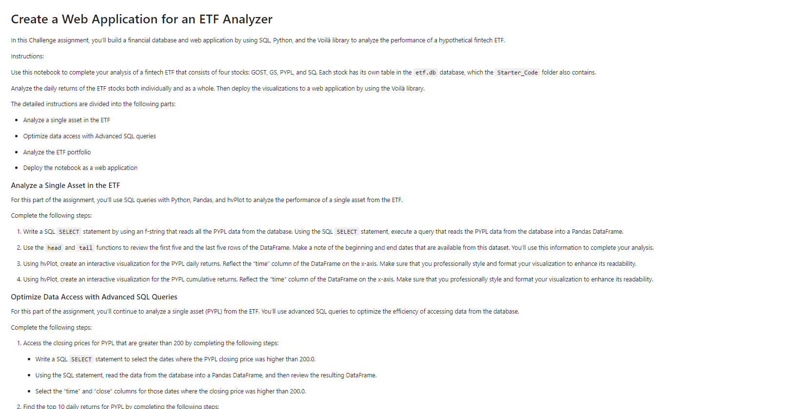
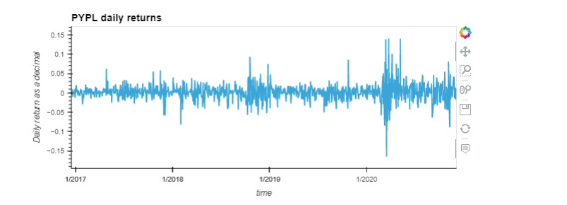
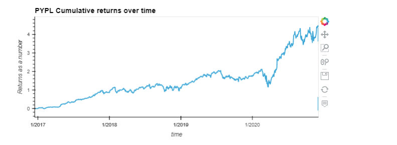
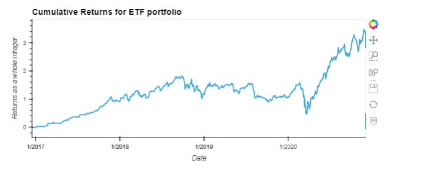

# ETF Analysis with SQL
Challenge 7 for fintech bootcamp through UC Berkeley, using SQL to pull data from a database provided via sqlite engine. The goal of this analysis was to query data from an SQL database into dataframes. Then plot or show the results of the ETF's over time via interactive hvplots and using the voila package to display it locally on a webpage.

---
## Packages and Version

First before installing any packages and getting setup make sure you are in a `dev` environment or an environment(env) you are comfortable downloading packages into. If you don't know what a `dev` environment is follow along below. 
To get your `dev` environment setup do the following in your command line:

- Creating a dev environment for python 3.7 called 'dev' - if you do not already have an environment setup 
    - Get setup in your preferred CLI (Gitbash, terminal, etc)
    - `conda create -n dev python=3.7 anaconda`
    - Once you have created the environment, type the following to activate and deactivate.

Once you are setup with your `dev` or similar env the only packages you need to have are listed below:

- hvplot == 0.8.1 or higher
- up-to-date voila package
- up-to-date sqlalchemy package

Simply do a `pip install package` replacing 'package' with the package name you are missing. 
Next make sure you clone the repo locally in the directory of your choice and follow below once ready.

## Usage and Results
Alright once you have the repo locally, open your CLI of choice, and type `voila etf_analyzer.ipynb`, you should see a new tab pop up with a local URL and a page looking like this one below 

scroll down a little further and you will see the dataframes and the charts, for this readme I will just show the resulting graphs which you can see below.

These images above will be interactive charts allowing you zoom and pan as desired if you want to focus on more specific time zones. 
We can see from the resulting images above that the ETF did fairly well over the timeframe, growing about 3x total over the ~4 years of data analyzed. 

---
## Contributors

[Robin Thorsen](https://www.linkedin.com/in/robin-thorsen-079819120/) was the main developer/analyst working on this project. Starter code and resources provided by UC Berkeley.

Best reached via email - robinbthorsen@gmail.com

---

## License

Apache 2.0 public License applied, feel free to clone and fork and use and reach out if you have questions. 

